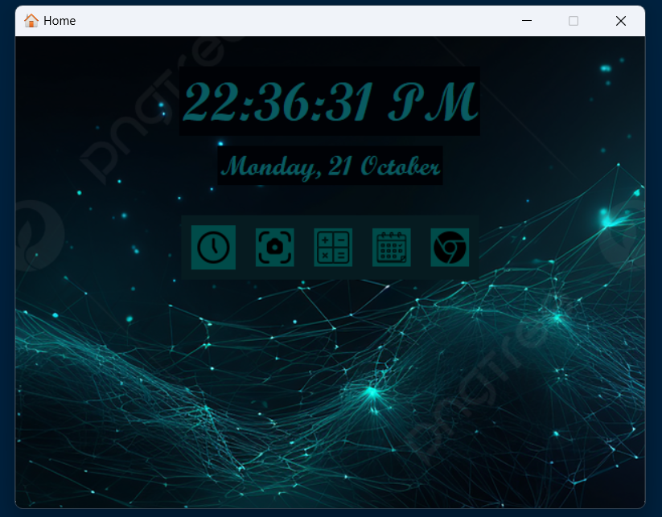

# Home Application

A Python-based GUI application built using the `tkinter` library that serves as a home screen for launching various utilities like clock, camera, calculator, calendar, and a browser.

## Output



## Features
- **Real-Time Clock and Date**: Displays the current time and date, updated dynamically.
- **Quick Launch Buttons**:
  - Open the Clock app.
  - Open the Camera app.
  - Open the Calculator app.
  - Open the Calendar app.
  - Open Google in the default web browser.
- **Customizable Background**: Includes a background image for an enhanced visual experience.

## Requirements
- Python 3.x
- Required Python libraries:
  - `tkinter`
  - `Pillow` (for handling images)
  - `webbrowser`
  - `subprocess`
  - `os`

## Installation
1. Clone the repository:
   ```bash
   git clone https://github.com/BNB2006/Tkinter-Python-project.git

<br><i><b>Feel free to customize, enhance, and use this program for educational or practical purposes!
##